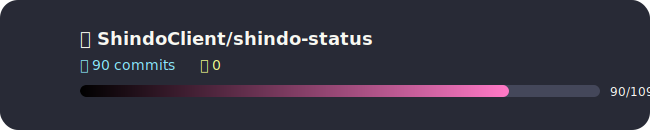
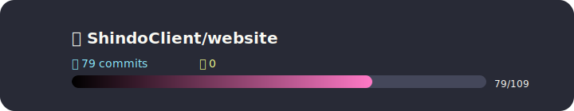
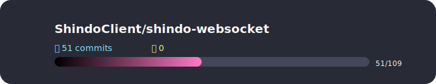

# hey, i'm miki 👋

**developer • open source enjoyer • minecraft modder**

*building things with kotlin, java & whatever else looks fun*

---

## 💻 Tech Stack

**Languages**

**Frameworks & Libraries**

**Databases**

**Cloud & Infra**

**Tooling & Build**

**Design**

---

## 📊 GitHub Stats

  

---

## 🏆 GitHub Trophies

  

---

## 🔝 Top Contributed Repositories

  
   
  
   
  
   
  
   
  

---

## 💰 Support

If you enjoy my work, a coffee helps a lot!

